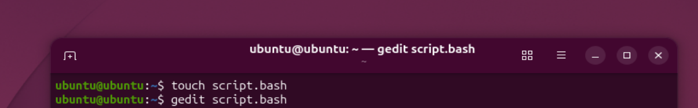
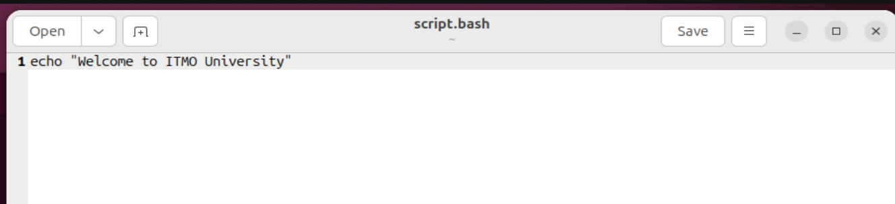
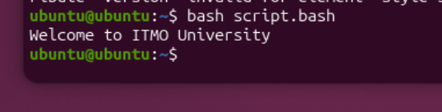

Выполнил Попилев Александр

# Отчет

Для начала я скачал менеджер виртуальных машин Oracle Virtual Box и ISO ubuntu. Создал и запустил виртуальную машину. Уже на месте открываем терминал и начинаем выполнение работы.

## Выполнение

Создаем файл `script.bash` и открываем его для дальнейшего выполнения. Используем команды `touch` и `gedit` соответственно.



Далее по заданию вносим специальную волшебную команду 

```bash
echo "Welcome to ITMO University"
```



Проверим работу



Все ультра круто работает.

## Специальное задание

Нужно сделать такой файл, при вызове которого, в терминале появлялось приветствие с именем, которое мы введем.

Сделаем это с помощью данного символа `$*`, который позволяет считать строку и вывести.

